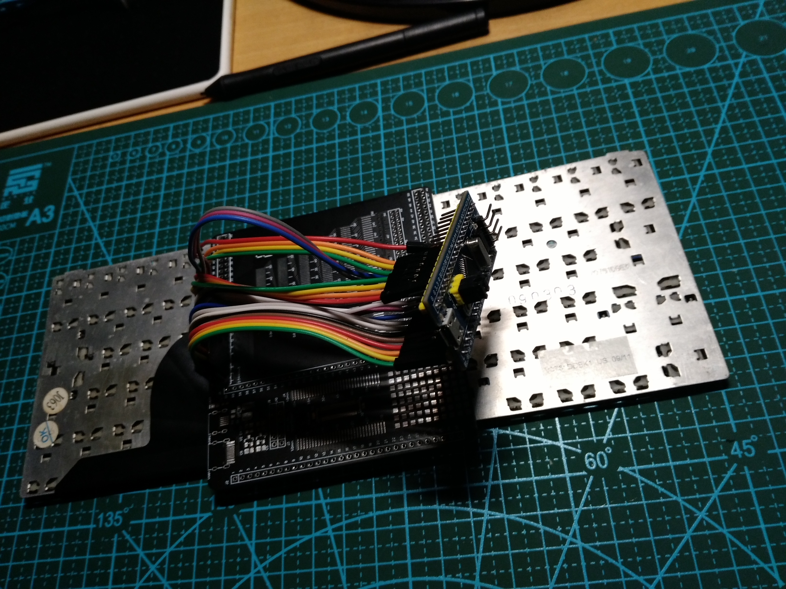

# Stm32键盘阵列排线顺序探测器

## 简介
如果你希望把旧笔记本键盘改造为usb的形式，或者你希望对已有的键盘进行深层次的改造。那么你可能需要了解所需要改造的键盘上按键排布的方式以及排线定义！过去这个过程是艰难且漫长的，你需要使用一些简易的自制工具对每个引脚进行检测，这往往需要耗费大量的时间。

### 本工具可以为你的事情
- [x] 免除大量对飞线焊接
- [x] 实时扫描按键，并输出对应的引脚映射
- [x] 串口输出按下的按键（如果存在按键映射表）
- [ ] 全自动生成按键映射表
- [ ] 实现usb按键

## 材料
- Stm32F103 最小系统板子 (可用国产HK32F103替代)
- FPC转接板 (可以前往立创eda社区，下载开源的PCB文件，并且5元打板制造)
- FPC转接底座 (通常使用1.0间距 建议先量一量键盘排线的长度)
- 一些杜邦线 

## 步骤
- 安装FPC转接板
- 把键盘插到FPC转接板上
- 通过杜邦线从FPC转接板上再次转接到Stm32F103最小系统板子上
- 使用Arduino IDE编译固件上传 （需要手动设置gpio ：按照上一步接线的情况进行设置）

- 打开串口监视器，并尝试按下键盘（插在FPC转接板上的）上的任意键，观察串口监视器是否有相应输出

### 串口输出数据格式

- 探针：指的是作为探针的引脚，该引脚会在扫描时输出高电平
- 接收：当前除探针外剩下的引脚进入输入模式，试图接收来自探针引脚的信号
- 探针[KBPinMap下标]:探针Pin
- 接收[KBPinMap下标]:接收Pin

### 试试看

解析：数组KBPinMap第11项与开发板对应的33号(PC14)引脚 输出高电平 并且被 数组KBPinMap第6项与开发板对应的1号(PA3)引脚 接收到，这意味着这时键盘上对应的这两个引脚是对应关系